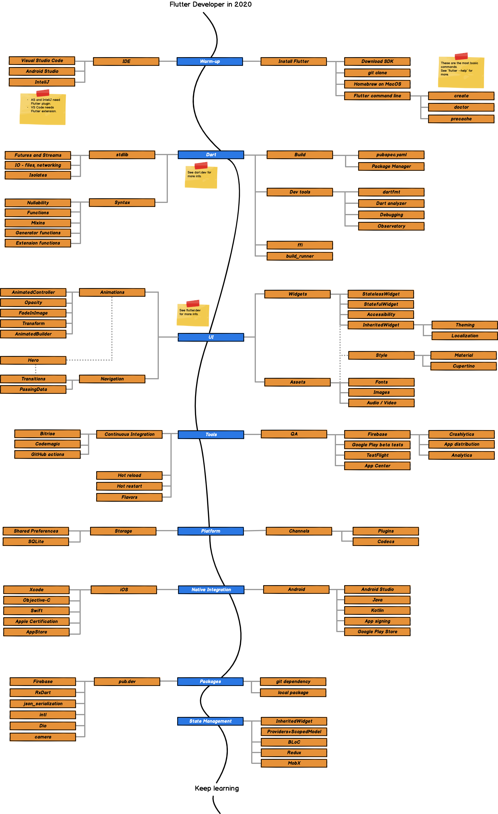

# Flutter Developer Roadmap 2020

## Purpose
 > The purpose of this roadmap is to help beginners to become a complete Flutter Developers and also to help skilled developers to improve their knowledge.

## How it works
> Roadmap shows main topics of Flutter development. Every topic is divided into smaller ones which creates a tree.
> Every node has a description, links to documentation, tutorials, videos and often exercises to get practical knowledge.

## Roadmap

## Table of contents

1. Warm-up
   1. [Command line exercises](https://github.com/DroidsOnRoids/flutter-roadmap/blob/master/flutter_cli/exercises)

## License

    Copyright 2020 Droids on Roids

    Licensed under the Apache License, Version 2.0 (the "License");
    you may not use this file except in compliance with the License.
    You may obtain a copy of the License at

       http://www.apache.org/licenses/LICENSE-2.0

    Unless required by applicable law or agreed to in writing, software
    distributed under the License is distributed on an "AS IS" BASIS,
    WITHOUT WARRANTIES OR CONDITIONS OF ANY KIND, either express or implied.
    See the License for the specific language governing permissions and
    limitations under the License.
