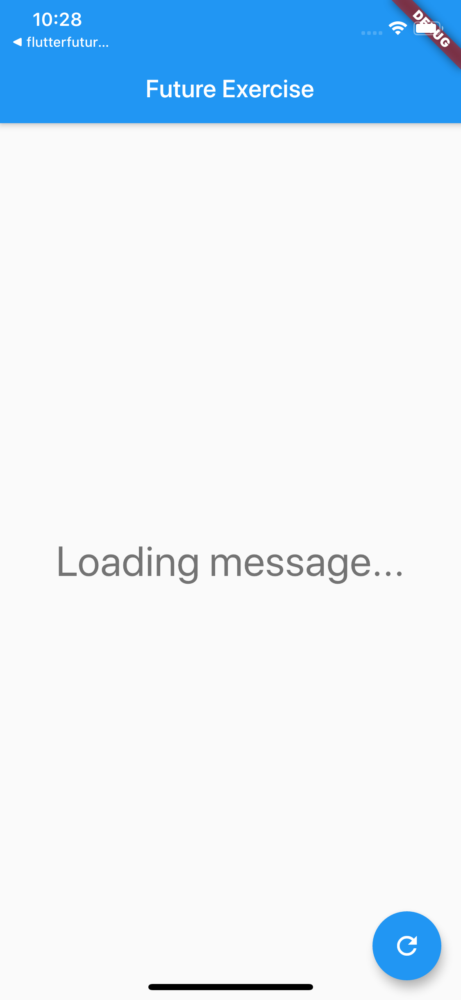
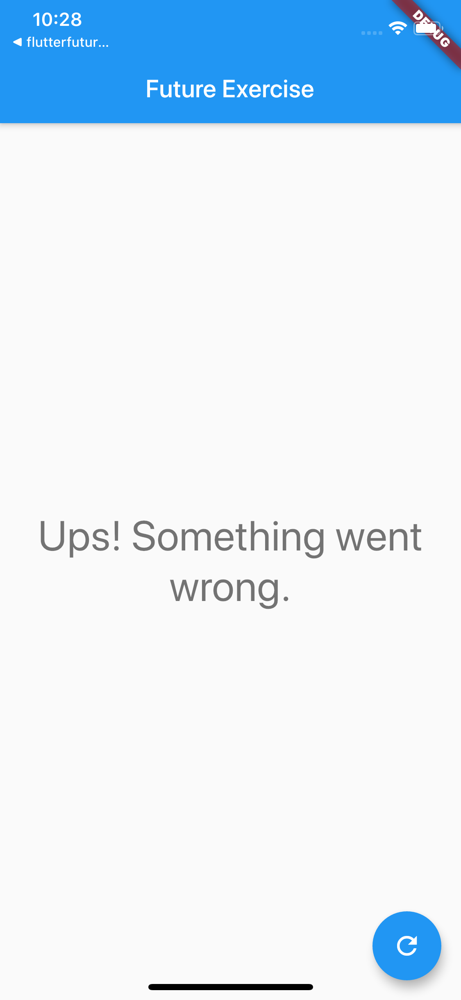
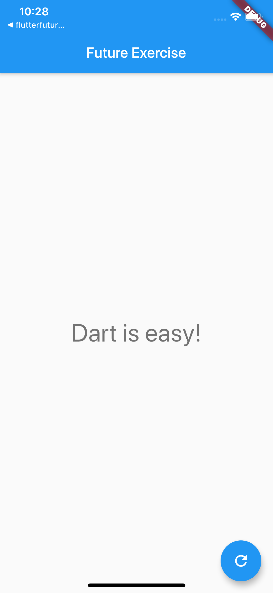

# Exercise 6

Future in Flutter's UI tree.

Add `Text` widget as the `Column` child.  
Text should display message got from `_fetchMessage` method.  
Use FutureBuilder to handle asynchronous method in UI tree.  

1. Set `"Loading message..."` text when message is loading.  
   
   

2. Set `"Ups! Something went wrong."` text when error occurred.  
   
   

3. Set fetched message as text in case of success.
   
   

